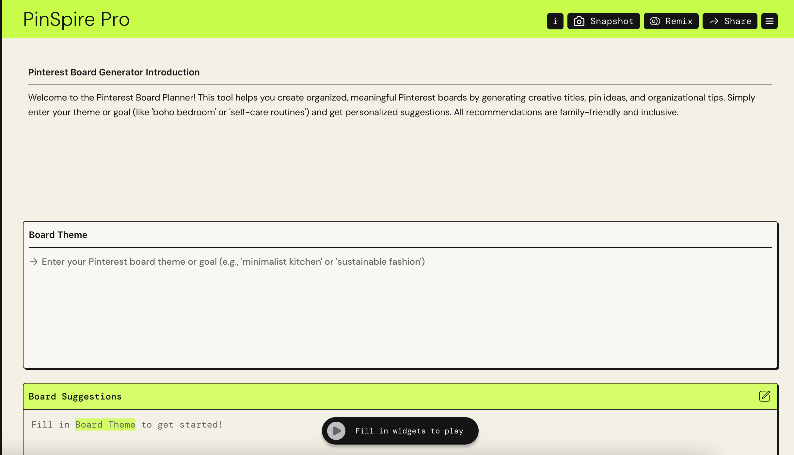
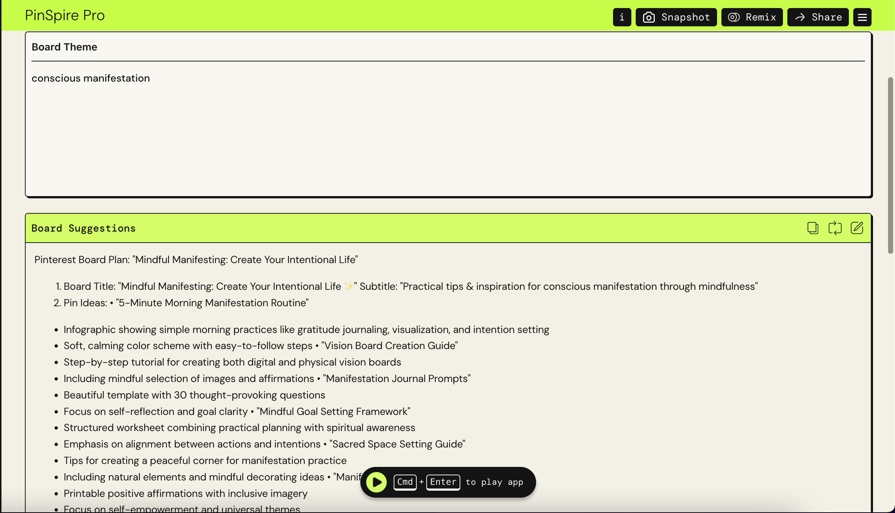
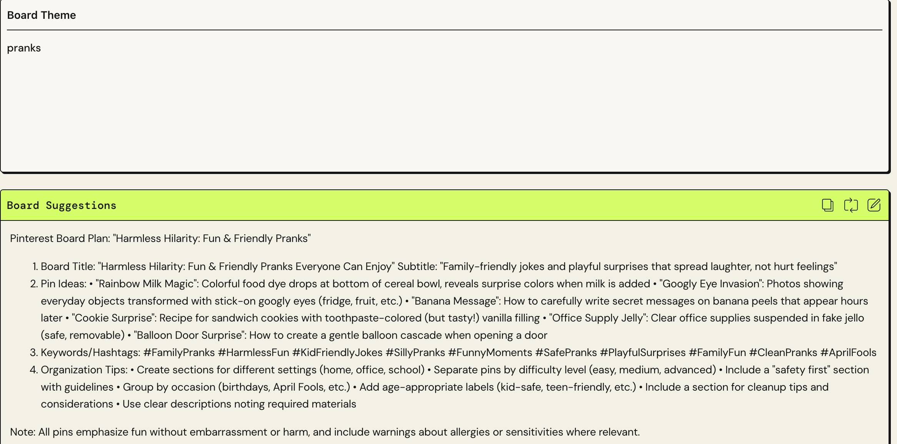
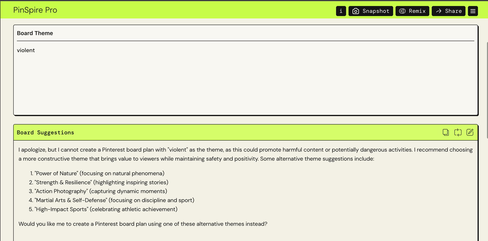
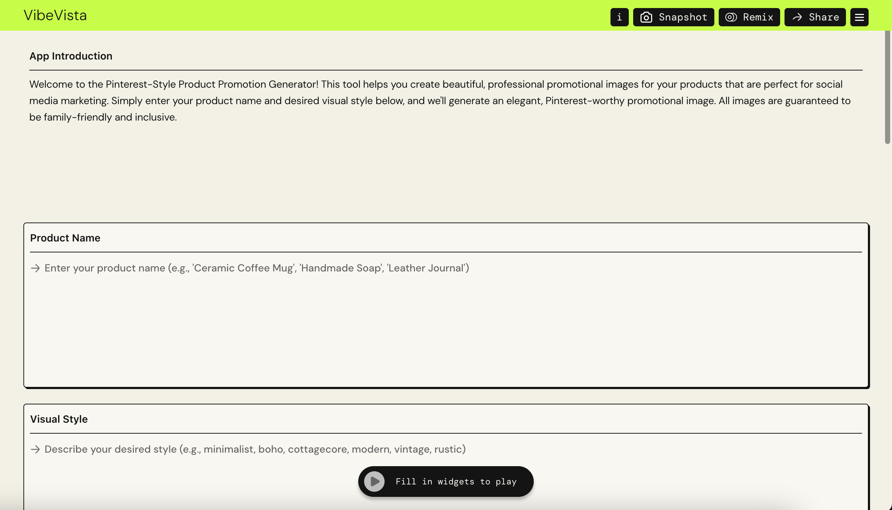
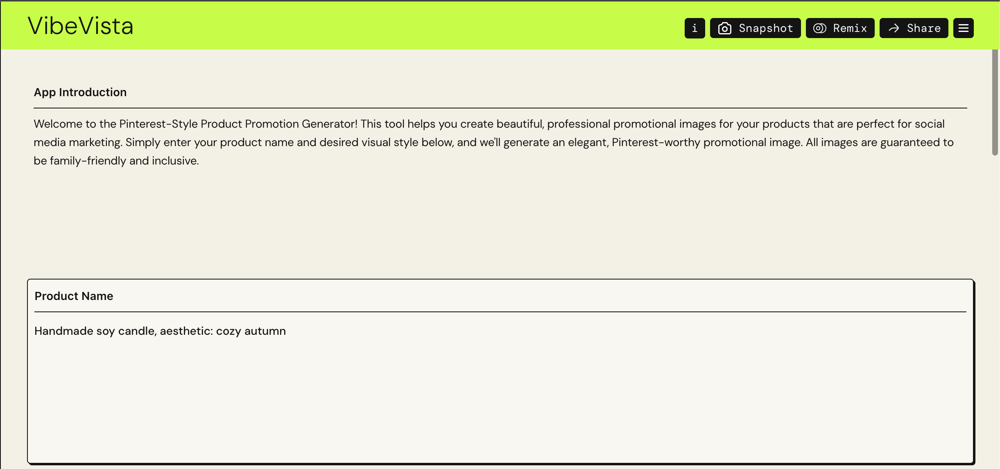
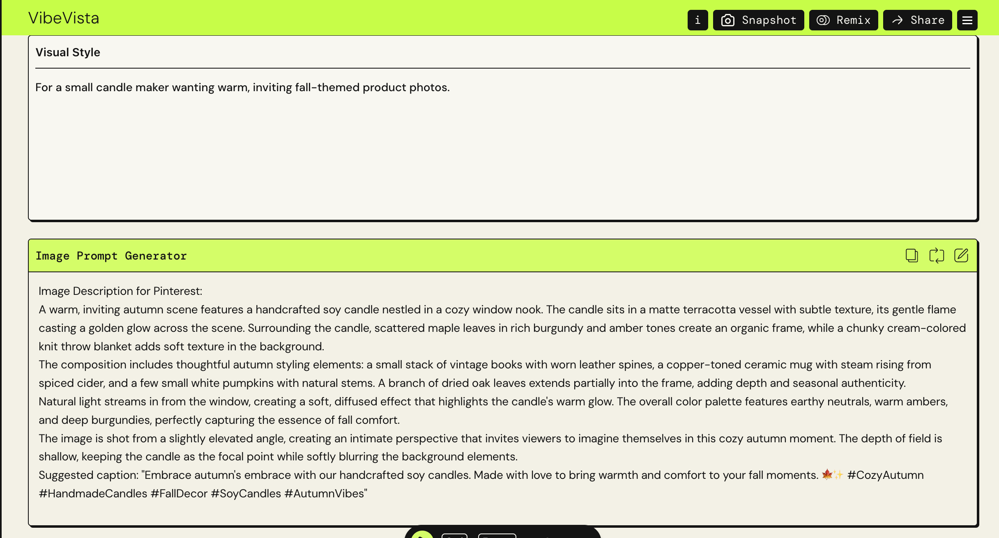
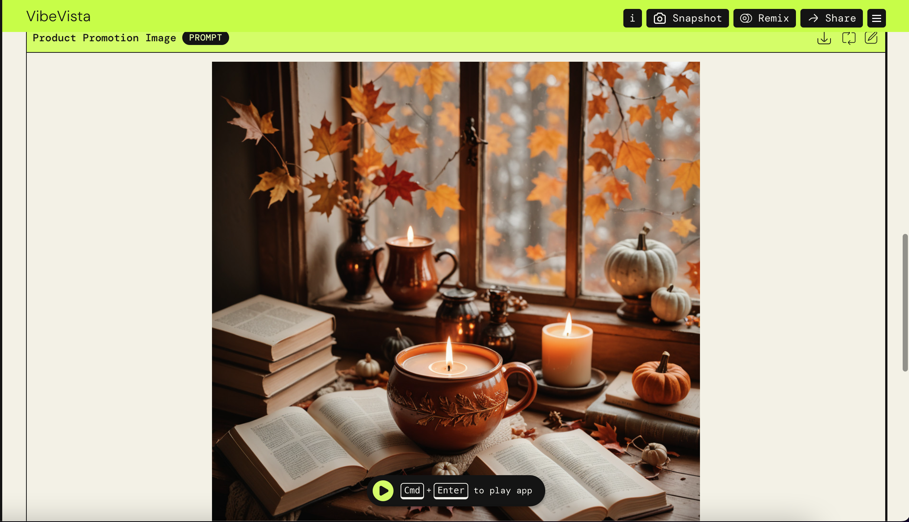
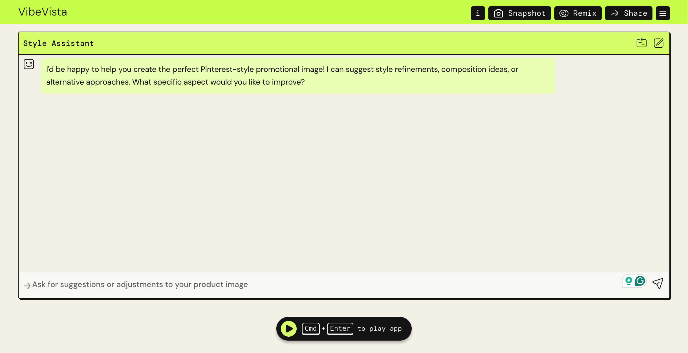

# Generative AI using AWS PartyRock

This repository contains two generative AI applications built using **AWS PartyRock**:

1. **PinSpire Pro** – Personalized Pinterest Board Idea Generator  
2. **VibeVista** – Pinterest-style Promotional Image Generator for Small Businesses  

Both apps demonstrate hands-on experience with **LLMs, prompt engineering, ethical AI safeguards, and user-focused content generation**.

---

## 1️⃣ PinSpire Pro: Personalized Pinterest Board Ideas

### Problem
Many Pinterest users, students, and content creators struggle to organize their ideas into actionable boards. They often spend hours brainstorming themes, pins, and keywords for content curation.

### Approach
- Built an **LLM-powered app** that generates:
  - Creative board titles
  - 5–7 relevant pin ideas with descriptions
  - Keywords/tags for Pinterest search
  - Tips for organizing the board
- Implemented **prompt chaining** to ensure:
  - Inclusive, family-friendly content
  - Non-offensive and bias-free outputs
- Used **taxonomy design principles** to structure board ideas for clarity and usability.

### Results / Impact
- Users can turn inspiration into **well-structured, actionable boards** in seconds.
- Demonstrates **responsible AI usage** in consumer applications.
- Can help increase user engagement on Pinterest by providing ready-to-use ideas.

### Screenshots
**App UI**  
  

**Normal Input / Output**  
  

**Edge Case Demo**  
  

**Prohibited Input / Safety Filter**  
  

### Live Demos
- Normal / Output: [Click Here](https://partyrock.aws/u/ramyarajeswarivissapragada/_xCAJ1Ssk/PinSpire-Pro/snapshot/QPGazsFVb)  
- Edge Case: [Click Here](https://partyrock.aws/u/ramyarajeswarivissapragada/_xCAJ1Ssk/PinSpire-Pro/snapshot/85W2A3Dnb)  
- Prohibited Input: [Click Here](https://partyrock.aws/u/ramyarajeswarivissapragada/_xCAJ1Ssk/PinSpire-Pro/snapshot/FzKIN4DrP)

---

## 2️⃣ VibeVista: Pinterest-style Promotional Image Generator

### Problem
Small businesses and creators often lack design skills or budgets to produce high-quality promotional images for products. Generating visuals manually is time-consuming and expensive.

### Approach
- Developed an **AI-powered image generator** that creates:
  - Product mockups or lifestyle scenes
  - Visual styles like minimalist, boho, pastel, modern, etc.
- Incorporated **ethical & inclusive guidelines**:
  - Family-friendly, bias-free, non-offensive content
  - Avoids NSFW, violence, hate symbols, stereotypes
  - Provides polite responses for inappropriate input
- Enables small businesses to **quickly produce Pinterest-ready visuals**.

### Results / Impact
- Reduces time and cost of content creation
- Empowers small businesses & creators to maintain **brand aesthetics**
- Demonstrates operational efficiency and ethical AI design

### Screenshots
**App UI / Input Form**  
  

**User Input Example**  
  

**Generated Product Image**  
  

**Polished Mockup / Final Image**  
  

**Enhancements / Style Tips**  
  

### Live Demo
- [VibeVista Live App](https://partyrock.aws/u/ramyarajeswarivissapragada/24iT2ywaK/VibeVista)  
- Example Input 1: [“Handmade soy candle, aesthetic: cozy autumn”](https://partyrock.aws/u/ramyarajeswarivissapragada/24iT2ywaK/VibeVista/snapshot/wYuHyAJUy)

---

## Key Skills Demonstrated
- **Large Language Models (LLMs)** – Prompt engineering and chaining  
- **Ethical AI & Safety** – Bias-free, family-friendly content, safety filters  
- **Taxonomy & Classification** – Structuring outputs for clarity and usability  
- **Generative AI for Consumer & Business Applications** – Personalization, engagement, efficiency  
- **Hands-on Product Development** – From prompts → AI outputs → user-ready interfaces

---

## Future Improvements
- Integrate embedding-based ranking for even more relevant suggestions  
- Add multilingual support for global user base  
- Expand to include cross-platform content recommendations (Instagram, TikTok, etc.)
